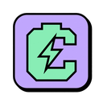

<div align="center">
  
  <h1>🔋 CasYuk</h1>
  <p><b>A Next-Generation, Cross-Platform Emotional Battery Management System</b></p>
  
  <p>
    <a href="https://github.com/Teddir/casyuk/releases/latest"></a>
    
    
    
    
    <a href="https://github.com/Teddir/casyuk/blob/main/LICENSE"></a>
  </p>

  <p>
    <a href="#-overview">Overview</a> •
    <a href="#-core-features">Features</a> •
    <a href="#-installation">Installation</a> •
    <a href="#-technology-stack">Tech Stack</a> •
    <a href="#-contributing">Contributing</a> •
    <a href="#-support--sponsorship">Sponsors</a>
  </p>
</div>

---

## 📖 Overview

**CasYuk** is not just another battery monitor. Most battery management tools fail because they rely on passive notifications that users quickly learn to ignore. CasYuk attacks the problem through **behavioral psychology and emotional triggers**. 

By utilizing dynamic, high-quality **green-screen (chroma-key) video overlays**, CasYuk creates a sense of urgency and emotional connection that actively changes user charging habits in real-time. Built for power users and teams who care about maximizing lithium-ion hardware longevity, CasYuk combines extreme performance (via Rust) with a premium **Neo-Brutalist** UI.

## ✨ Core Features

*   🌍 **True Cross-Platform**: Native battery telemetry on **macOS (IOKit)**, **Windows (WMI)**, and **Linux (UPower/Sysfs)**.
*   🎭 **Chroma-Key Video Engine (Pro)**: Replaces boring push notifications with transparent, high-fidelity video overlays that demand attention.
*   ⚡ **Smart Charge Limiter**: Automatically stops charging at 80% to preserve battery cell chemistry (hardware dependent).
*   📊 **Behavioral Analytics**: Tracks success metrics (*time to response after notification*, *plug rate*) to validate the emotional trigger's effectiveness.
*   🚀 **Insanely Fast & Lightweight**: Powered by Tauri v2 and Rust, ensuring near-zero CPU/RAM overhead while continuously monitoring hardware states.
*   🔄 **Seamless Auto-Updates**: Built-in CI/CD pipeline pushes delta updates directly to users globally.

## 🚀 Installation

You can install CasYuk with a single command on any supported operating system.

### macOS & Linux (Terminal)
```bash
curl -sSL https://raw.githubusercontent.com/Teddir/casyuk/master/scripts/install.sh | bash
```

### Windows (PowerShell)
```powershell
iwr -useb https://raw.githubusercontent.com/Teddir/casyuk/master/scripts/install.ps1 | iex
```

Alternatively, download the latest compiled binary installers directly from our [Releases Page](https://github.com/Teddir/casyuk/releases/latest).

### Building from Source

Ensure you have **Node.js 22+** and **Rust** installed on your machine.

```bash
# Clone the repository
git clone https://github.com/Teddir/casyuk.git
cd casyuk

# Install frontend dependencies
npm install

# Run in development mode
npm run tauri dev

# Build for production
npm run tauri build
```

## 🛠️ Technology Stack

CasYuk is engineered using a modern, scalable, and memory-safe technology stack:

*   **Core Logic & Hardware Access**: Rust (`std::process::Command`, `WMI`, `sysfs`, `ioreg`)
*   **Application Framework**: Tauri v2
*   **Frontend UI**: React 19 + TypeScript + Vite
*   **Styling**: Pure CSS with Neo-Brutalism aesthetic
*   **Analytics**: Aptabase (Privacy-First Event Tracking)
*   **CI/CD**: GitHub Actions (Automated Cross-Platform Compilation)

## 🤝 Contributing

We welcome community contributions! Whether you're fixing bugs, improving cross-platform Rust adapters, or submitting new green-screen videos for the Video Bank, your help is appreciated.

Please read our [CODE_OF_CONDUCT.md](CODE_OF_CONDUCT.md) to understand our community standards. 

1. Fork the Project
2. Create your Feature Branch (`git checkout -b feature/AmazingFeature`)
3. Commit your Changes (`git commit -m 'Add some AmazingFeature'`)
4. Push to the Branch (`git push origin feature/AmazingFeature`)
5. Open a Pull Request

## 🛡️ Security Policy

We take security seriously. If you discover a security vulnerability within CasYuk (e.g., privilege escalation in the battery limiting scripts), please DO NOT open a public issue. 

Instead, send an email to **teddir.ads@gmail.com**. We will address the issue promptly and provide a patch in the next release. See [SECURITY.md](SECURITY.md) for more details.

## 💖 Support & Sponsorship

CasYuk is an open-source project maintained by a passionate team. If CasYuk has saved your laptop battery or helped your workflow, consider supporting our development!

Your donations help us cover Apple Developer Program fees, server costs for Video Bank hosting, and open-source bounties.

*   ☕ **[Buy us a Coffee](https://buymeacoffee.com/Teddir)**
<!-- *   💖 **[GitHub Sponsors](https://github.com/sponsors/Teddir)**
*   💳 **[Patreon](https://patreon.com/casyuk)** -->

**Enterprise Users:** Purchasing a **CasYuk Pro Lifetime License** via [Lemon Squeezy](https://casyuk.lemonsqueezy.com/buy/casyuk-pro) is the best way to support the project while unlocking advanced features.

## 📄 License

CasYuk is licensed under the **GNU General Public License v3.0 (GPLv3)**. 

This strong copyleft license ensures that CasYuk remains strictly open-source. Anyone who distributes modified or derivative works based on this project **must** release their source code under the same GPLv3 license. This legally prevents other companies or individuals from taking your code and closing it off into a proprietary, commercialized product.

See the [LICENSE](LICENSE) file for more information.

---

<div align="center">
  <p>Built with ❤️ by <b>Teddir</b> and the Open Source Community</p>
</div>
